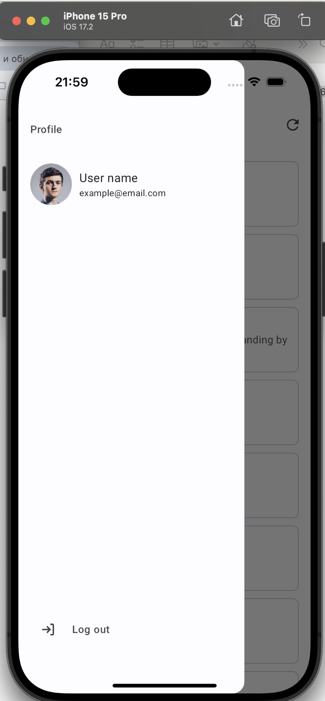

# photo_app

An application with authorization with a list of photos sorted alphabetically. It has a dark and light theme depending on the device settings.
To install dependencies, you need to go to the pubspec.yaml file and click the pub get button.
Main working branch dev

[//]: # (![Project]&#40;./assets/images/main_background.png&#41;)

Non-functional requirements:
- [x] Compatibility:
  Acceptance criteria:
- [x] Android: starting from API level 28
- [x] iOS: latest version and 2 previous versions

- [x] Every data-bound operation should have loading, error, empty, data state on UI
- [x] Use material behavior (e.g. ripple effect, elevation etc.)
- [x] Follow the design theme, text styles and dimentions
- [] Dark/light mode support (optional)
  TIP: There is an exported color scheme at the bottom of document

Functional Requirements:
- [x] As a user I want to log in the app so that I can access the app functionality
  Design label: Log in
  API documentation:
- [x] request url: https://randomuser.me/api/
- [x] request body (FYI: request body will be ignored in the response):
  {
  “email”: String,
  “password”: String
  }
  Acceptance criteria:
- [x] There is validation for inputs (there are validation rules below)
- [x] Validation triggers: (login-button pressed; input lost focus)
- [x] Reset error state on value changed
- [x] After successful login, users are redirected to the main page
- [x] Disable inputs and button on request

- [x] As a user I can view feed of photos so that I can find desired kind
  Design label: Main (grouped)
  API documentation:
    - [x] https://www.pexels.com/api/documentation/#photos-curated 	
      use https://api.pexels.com/v1/curated?per_page=50
      for UI use image resource (url or any src), photographer name and alt (it could be empty)
      Acceptance criteria:

- [x] There is a local sorting implemented by name (ASC)
- [x] The list is grouped by name
  TIP: UI should not freeze during sorting/grouping with huge dataset
    - [x] As a user I can refresh the feed so that I can get actual data
      Acceptance criteria:
- [x] There is an option to refresh the feed

-

Technical Requirements:
Architecture Flutter for test task:
- [x] https://pub.dev/packages/bloc;
- [x] https://pub.dev/packages/dio;

Validation rules:
email:
- [x] Should be between 6 and 30 characters
- [x] RegEx: ^[a-zA-Z0-9.!#$%&'*+\\/=?^_`{|}~-]{1,10}@(?:(?!.*--)[a-zA-Z0-9-]{1,10}(?<!-))(?:\.(?:[a-zA-Z0-9-]{2,10}))+$
  password:
- [x] Should be between 6 and 10 characters
- [x] Uppercase letter is required
- [x] Lowercase letter is required
- [x] Digit is required
